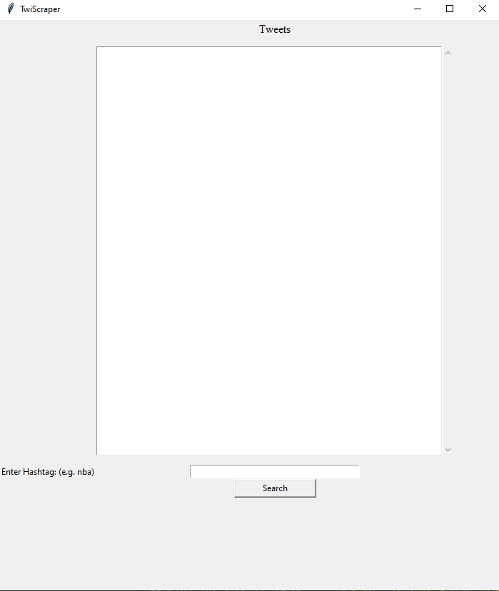
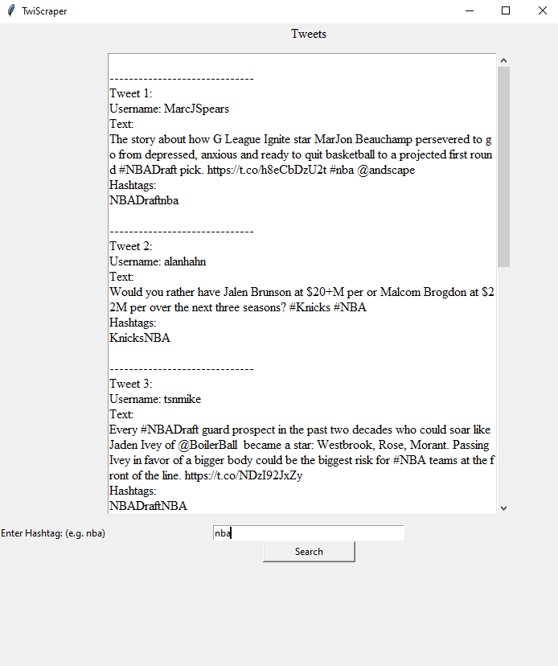

One of my first python projects that I ever created. This is a twitter bot that scrapes twitter for a specific user defined hashtag and finds the top most results.
While this kind of program would probably work better running from a webserver, where the api connection is more secure and not available for the basic user, it a program that helped me learn how to program in python.

  
Here is the main window of the application it allows the user to enter any hashtag(for example: nba) and the program will then look for the top 5 tweets containing this hashtag(see below).
  
